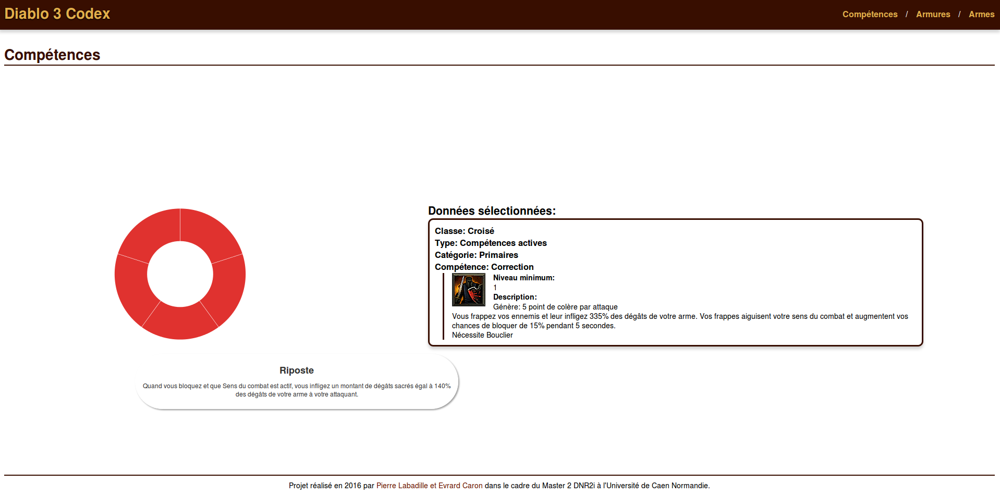

# diablo3-codex

The goal of this project is to create a data explorer witch use crawled data and display it on a dynamic graph.
This project is became a Diablo3 codex. It regroup the skills of each class, weapons and armors pieces witch are obtain in the adventure.
It's a group project involving Evrard Caron and Pierre Labadille, students in M2-DNR2i from the University of Caen.



## Installing

Clone the repository (localy or in node server)
```
git clone https://github.com/Five52/diablo3-codex.git
cd diablo3-codex
```

Install the dependencies

If you don't have npm, you need to install it. There is a procedure you can follow (otherwise google is your friend):``
```
wget -qO- https://raw.githubusercontent.com/creationix/nvm/v0.32.1/install.sh | bash
export NVM_DIR="$HOME/.nvm"
[ -s "$NVM_DIR/nvm.sh" ] && \. "$NVM_DIR/nvm.sh" # This loads nvm
nvm install node
```
Then you just need to run npm install
```
cd nodejs
npm install
```

## Fill the database 
```
npm start
```
Then go in you browser in the folowing url:
* [`http://localhost:3000/insert`](http://localhost:3000/insert)
You should have a confirmation message. Don't run the url twice, you will duplicate the data otherwise.

## Launch the application

It should already work (unless you stop the server, just run npm start again if you did).

## Built with

* [`Scrapy`](https://scrapy.org/)
* [`NodeJs`](https://nodejs.org)
* [`MongoDb`](https://www.mongodb.com/fr)
* [`d3.js`](https://d3js.org/)
* [`Twig`](http://twig.sensiolabs.org/)


## License

This project is licensed under the GNU License - see the [LICENCE](LICENSE) file for details

